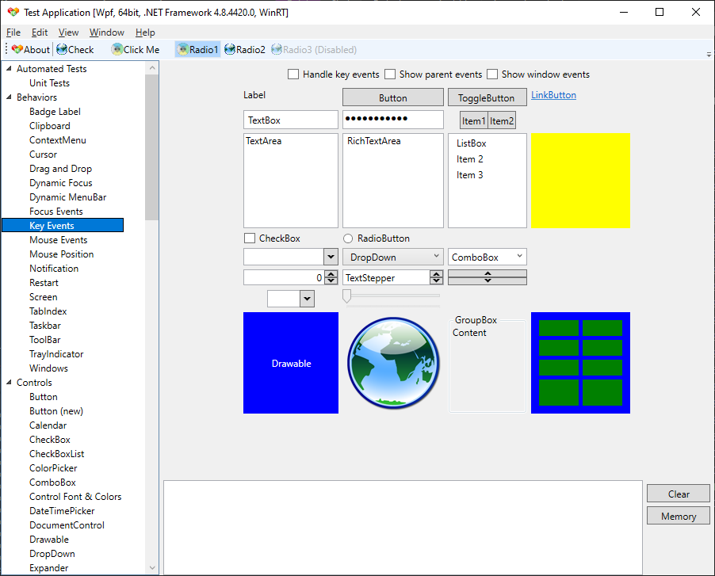
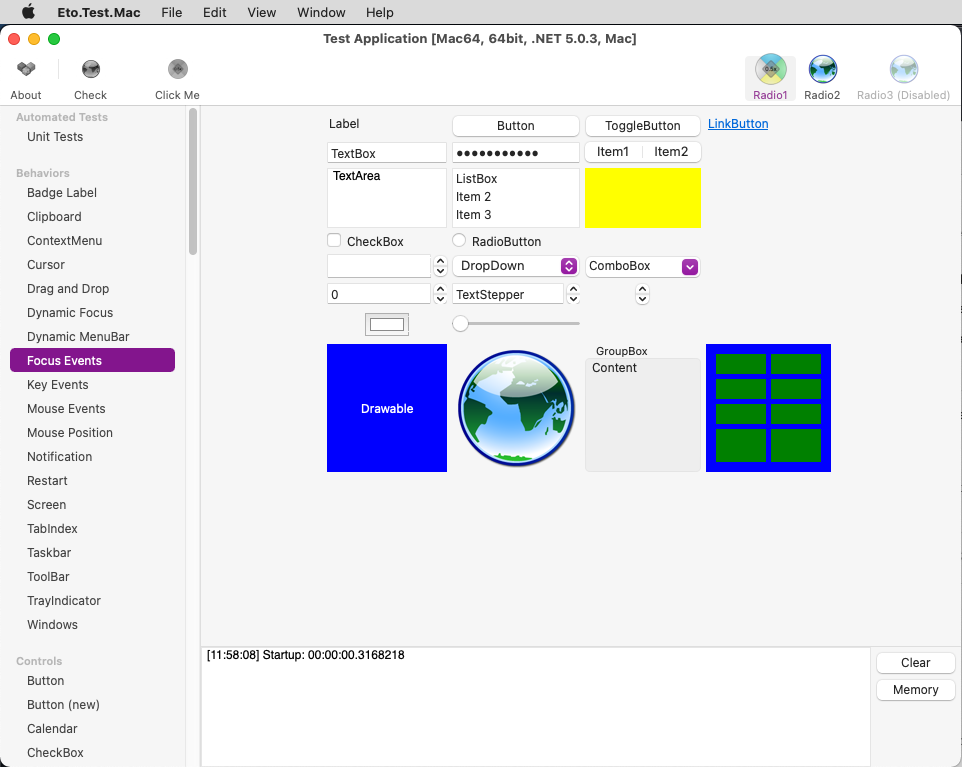
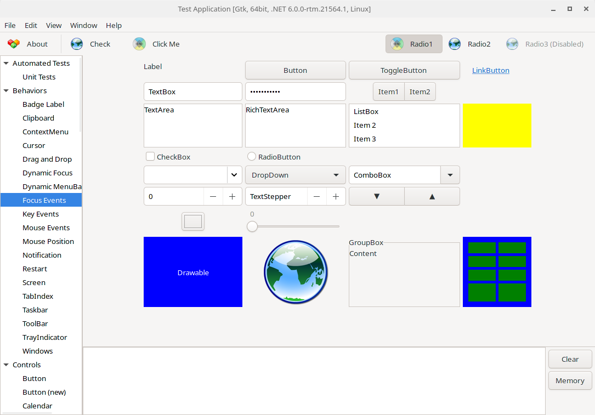

Eto.Forms
=========
### A cross platform desktop and mobile user interface framework

[](https://github.com/picoe/Eto/actions/workflows/build.yml)
[](https://github.com/picoe/Eto/discussions)
[](https://gitter.im/picoe/Eto)
[](https://github.com/picoe/Eto/wiki)
[](https://www.nuget.org/packages/Eto.Forms/)
[](https://www.myget.org/gallery/eto)

Description
-----------

This framework can be used to build applications that run across multiple platforms using their native toolkit, with an easy to use API. This will make your applications look and work as a native application on all platforms, using a single UI codebase.

For advanced scenarios, you can take advantage of each platform's capabilities by wrapping your common UI in a larger application, or even create your own high-level controls with a custom implementations per platform.

This framework currently supports creating Desktop applications that work across Windows Forms, WPF, MonoMac, and GTK#.
There is a Mobile/iOS port in the works, but is considered incomplete.

This framework was built so that using it in .NET is natural. For example, a simple hello-world application might look like:

```C#
using Eto.Forms;
using Eto.Drawing;

public class MyForm : Form
{
	public MyForm ()
	{
		Title = "My Cross-Platform App";
		ClientSize = new Size(200, 200);
		Content = new Label { Text = "Hello World!" };
	}
	
	[STAThread]
	static void Main()
	{
		new Application().Run(new MyForm());
	}
}
```

or in a F# script:

```fsharp
#load ".paket/load/eto.platform.windows.fsx"
// see https://fsprojects.github.io/Paket/paket-generate-load-scripts.html

open Eto.Drawing
open Eto.Forms

type MyForm() as this =
    inherit Form()
    do
        this.Title      <- "My Cross-Platform App"
        this.ClientSize <- Size (200, 200)
        this.Content    <- new Label(Text = "Hello F# World!")

Eto.Platform.Initialize(Eto.Platforms.WinForms)
let app = new Application()
let form = new MyForm()
form.Show()
```

Getting Started
---------------

To begin creating apps using Eto.Forms, follow the [Quick Start Guide](https://github.com/picoe/Eto/wiki/Quick-Start).

To compile or contribute to Eto.Forms, read the [Contributing Guide](https://github.com/picoe/Eto/wiki/Contributing).


Screenshots
-----------
Windows via WPF:  
  
Mac via MonoMac:  
  
Linux via GTK#3:  
  

Applications
------------
* [MonoGame Pipeline Tool](https://github.com/MonoGame/MonoGame) - Content manager for MonoGame
* [Manager](http://www.manager.io) - Accounting Software
* [PabloDraw](http://picoe.ca/products/pablodraw/alpha) - Character based drawing application
* [Notedown](https://github.com/cwensley/Notedown) - Note taking application
* [Eto.Test](https://github.com/picoe/Eto/tree/master/test/Eto.Test) - Application to test the functionality of each widget
* [DWSIM](https://github.com/DanWBR/dwsim5) - Chemical Process Simulator
* [Termission](https://github.com/junian/termission) - Cross-platform Serial/TCP Terminal with Scriptable Auto-Response
* [Visual SEO Studio](https://visual-seo.com/) - Technical SEO Auditing Tool
* [RegexFileSearcher](https://github.com/CommonLoon102/RegexFileSearcher) - Cross-platform regex file searching tool in .NET 5
* [RegexTestBench](https://github.com/CommonLoon102/RegexTestBench) - Cross-platform regex testing tool in .NET 5
* [GEDKeeper (v3)](https://github.com/Serg-Norseman/GEDKeeper) - Cross-platform application for working with personal genealogical databases

Third party libraries
----------

| |Pure Eto.Forms|[SkiaSharp](https://github.com/mono/SkiaSharp) edition| | |
|---|---|---|---|---|
|[ScottPlot](https://scottplot.net/quickstart/eto/)|[](https://www.nuget.org/packages/ScottPlot.Eto/)||Plotting library that makes it easy to interactively display large datasets.|[](https://user-images.githubusercontent.com/44544090/140962349-1986e503-65d0-41bc-ae93-98f1a38a0266.png)[](https://user-images.githubusercontent.com/44544090/140963641-50117714-7dfb-4fcf-b30a-3a5f9912965a.png)
|[LiveCharts](https://lvcharts.net/)||[](https://www.nuget.org/packages/LiveChartsCore.SkiaSharpView.Eto/)|Simple, flexible, powerful and open source data visualization for .Net.|[](https://user-images.githubusercontent.com/44544090/151693514-4ad24a59-547a-4e2a-8553-678f6d558c94.gif)[](https://user-images.githubusercontent.com/44544090/151693549-7337aa21-bbf7-470d-96c7-9c8d071252bc.gif)[](https://user-images.githubusercontent.com/44544090/151693577-92917ff3-bb85-4395-ac21-c64cecfdf9ed.gif)
|[Microcharts](https://github.com/microcharts-dotnet/Microcharts)||[](https://www.nuget.org/packages/Microcharts.Eto/)|Create elegant Cross-Platform simple charts.|[](https://raw.githubusercontent.com/rafntor/Eto.Microcharts/master/quickstart.png)
|[OxyPlot](https://oxyplot.github.io/)|[](https://www.nuget.org/packages/OxyPlot.Eto/)|[](https://www.nuget.org/packages/OxyPlot.Eto.Skia/)|Cross-platform plotting library for .NET.|[](https://user-images.githubusercontent.com/44544090/156793664-e7e883fa-46ac-47cc-8d6d-bf4010837218.gif)[](https://user-images.githubusercontent.com/44544090/156793675-1b95af06-e008-456c-a14e-06bf0a135103.gif)[](https://user-images.githubusercontent.com/44544090/156795115-252c0a8a-e176-4816-bb21-5d4f6da1128a.gif)
|[Mapsui](https://mapsui.com/)||[](https://www.nuget.org/packages/Mapsui.Eto/)|A C# map component for apps.|[](https://user-images.githubusercontent.com/44544090/155893193-3b7363ce-a72b-4dd8-8267-14ca26614f9e.gif)[](https://user-images.githubusercontent.com/44544090/155893198-959f6cc4-a9b7-4c4c-8caa-a81efa0e1109.gif)[](https://user-images.githubusercontent.com/44544090/155893201-e9a9658a-3105-4860-b60d-3b06e9ec0613.gif)
|[Eto.RainbowLoading](https://github.com/rafntor/Eto.RainbowLoading)|[](https://www.nuget.org/packages/Eto.RainbowLoading/)|[](https://www.nuget.org/packages/Eto.RainbowLoading.Skia/)|A control showing the Android loading indicator.|[](https://raw.githubusercontent.com/rafntor/Eto.RainbowLoading/master/Animation.gif)
|[Eto.GifImageView](https://github.com/rafntor/Eto.GifImageView)|[](https://www.nuget.org/packages/Eto.GifImageView/)||A control for displaying GIF's.|[](https://raw.githubusercontent.com/rafntor/Eto.GifImageView/master/Animation.gif)
|[Eto.SkiaDraw](https://github.com/rafntor/Eto.SkiaDraw)|[](https://www.nuget.org/packages/Eto.SkiaDraw/)||A control enabling use of SkiaSharp in Eto.
|[Eto.Containers](https://github.com/rafntor/Eto.Containers)|[](https://www.nuget.org/packages/Eto.Containers/)||Some extra Eto.Forms container controls.

&#128073; Note : Some packages are in the pipeline but will not appear until next release is created.

Assemblies
----------

Your project only needs to reference Eto.dll, and include the corresponding platform assembly that you wish to target. To run on a Mac platform, you need to [bundle your app](https://github.com/picoe/Eto/wiki/Running-your-application).

* Eto.dll - Eto.Forms (UI), Eto.Drawing (Graphics), and platform loading
* Eto.Mac.dll - MonoMac platform for OS X using 32-bit mono
* Eto.Mac64.dll - MonoMac platform for OS X using 64-bit mono
* Eto.XamMac.dll - Xamarin.Mac Classic platform for OS X to embed mono
* Eto.XamMac2.dll - Xamarin.Mac Unified platform for OS X to embed mono
* Eto.WinForms.dll - Windows Forms platform using GDI+ for graphics
* Eto.Direct2D.dll - Windows Forms platform using Direct2D for graphics
* Eto.Wpf.dll - Windows Presentation Foundation platform
* Eto.Gtk.dll - Gtk+3 platform for Mac, Windows, and Linux.
* Eto.Gtk2.dll - Gtk2 platform using gtk-sharp2 on Mac, Windows, and Linux.
* Eto.Gtk3.dll - [deprecated] Gtk3 platform for running on Linux with gtk-sharp3 package
* Eto.iOS.dll - Xamarin.iOS platform
* Eto.Android.dll - Xamarin.Android platform

Currently supported targets
---------------------------

* OS X: MonoMac or Xamarin.Mac
* Linux: GTK# 2 or 3
* Windows: Windows Forms (using GDI or Direct2D) or WPF
	
Under development
-----------------

These platforms are currently incomplete or in development. Any eager bodies willing to help feel free to do so!

* iOS using Xamarin.iOS
* Android using Xamarin.Android (Eto.Android)
